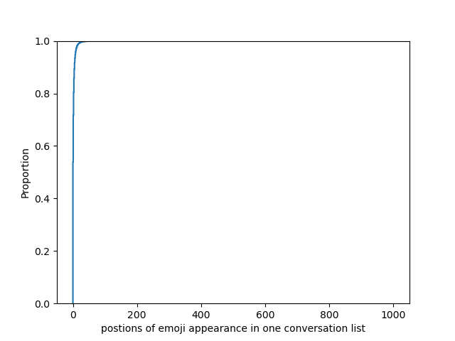
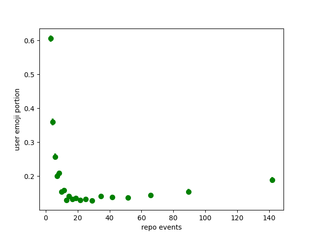
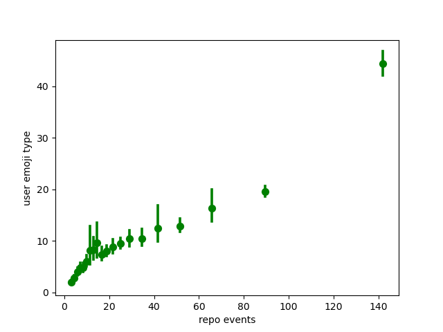
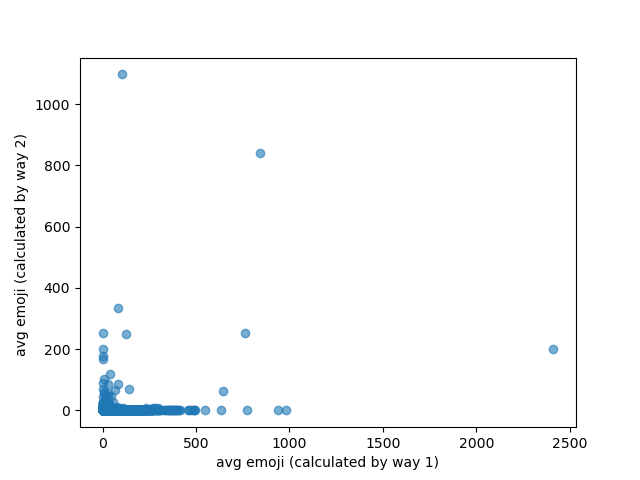
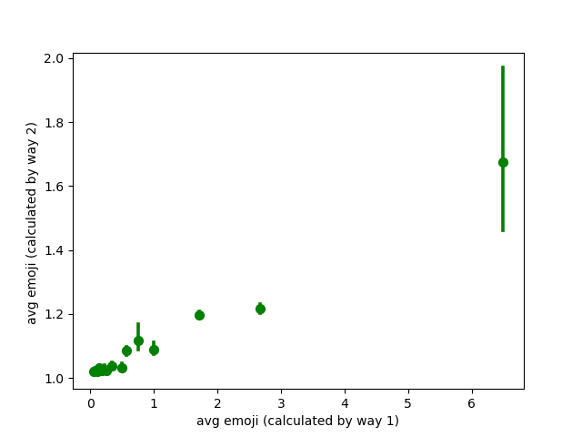

# Week 4

- [x] Finish calculating the first emergence of one post date 

（这里有一个话heatmap的问题）

- [x] Correct the mistake of results generated from last week.

- [x] 修改之前关于pull request 比例的问题 （没有加入Pr的问题)

- [x] 为什么两种计算average 得到的值不一样, 研究一下，通过画图 (partially done)

- [x] Introduce the variance as one metric for the event/emoji

Explore top repo

## Result

### Task 1:

It is done with only comments 

对于未去除所有comment has_emoji 均为false的情形：

- 平均回复长度(average response issue comment): 20.116163373833356
- median回复长度：13.0

所有issue里面有conversation的占比：0.06581247479974507

对于已经去除的情形：
In total Issue: 709381

- 平均回复长度：35.34
- median回复长度：19.0
-[] 分类讨论

Postion data of emoji appearance

- Max: 2217

- Median: 2.0

- Mean: 7.33575760553979

  总的分布图如下图如下：

Positions of emoji first appearance:

- Max 1001
- Median: 0
- Mean: 1.7502678605459414

-[ ] 分两类 issue has emoji/ no emoji 

-[] 对repo进行聚类分析，什么样的repo会比较早的出现emoji？根据comment里出现emoji的早晚

-[] repo里面连接是否紧密 是否和vector有相关性的，indicator 图的连通性

### Task 2 (task 4 included):

Method: Calculate comment based on issue and PR

#### X: the user number in one repo Y: average emoji usage p

#### X: the user posts containing emoji proportion in one repo, Y: user average events in one repo (marked)

#### X: user average events in one repo vs Y: Average Type of Emoji usage

### Task 3:

目前看是正相关,但散点图上看出qushi

-[] 两张图为什么趋势相反

### Task 5: 

Finished, but plot not ready at present
