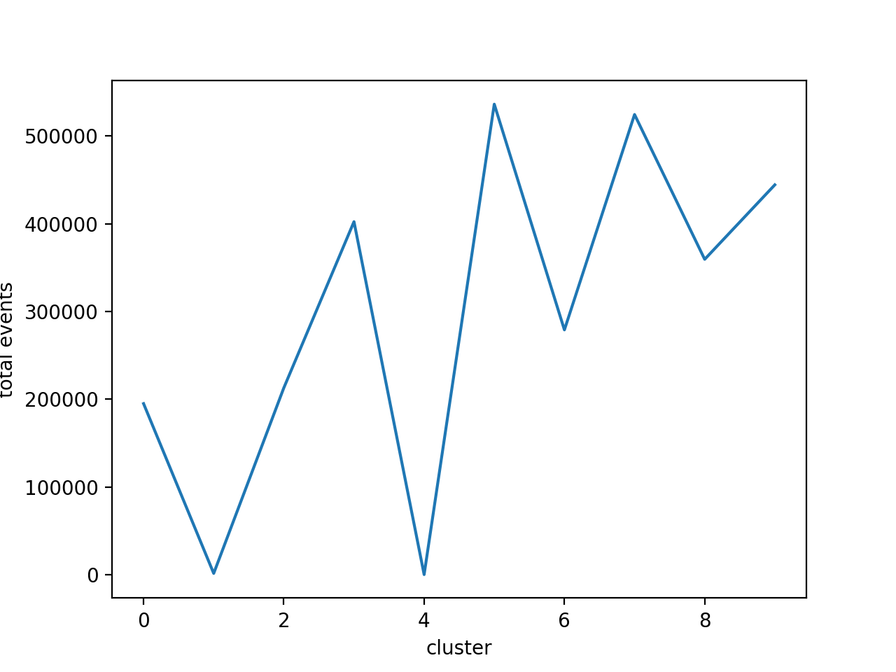

# Week 6

- [ ] Sort the repo by rid，先研究可聚类性，clusterability
- [ ] 不同cluster里的repo，是否emoji使用有相关性 (例如cluster 总数)
- [ ] 

## 带issue情形下：

(The case that there's no emoji in comment is omitted)

| max conversation length | mean conversation length | median conversation length |
| ----------------------- | ------------------------ | -------------------------- |
| 924                     | 3.35                     | 2.0                        |

Without issue data

| max conversation length | mean conversation length | median conversation length |
| ----------------------- | ------------------------ | -------------------------- |
| 923                     | 2.933                    | 1.0                        |

Question: why 2.0, and why the result is different from last week's analysis? In the calculation of conversation_comment_list, the result is (with already filtered)

|           |      |      |
| --------- | ---- | ---- |
| 2256  | 5.23 | 3.0  |

The analyze of the cluster is as follows.

****

PCA explained variance:

[0.35753838 0.19922561 0.17525353 0.07124343 0.05284577 0.03838035
 0.03392283 0.03313877 0.0319536  0.02524435]

Cluster Size:

[1822 1069 4697  396 1914  236   50   21  843  855]

感觉聚合性不是很高，orz

Frequency of it: 

Filter the 10 result:

